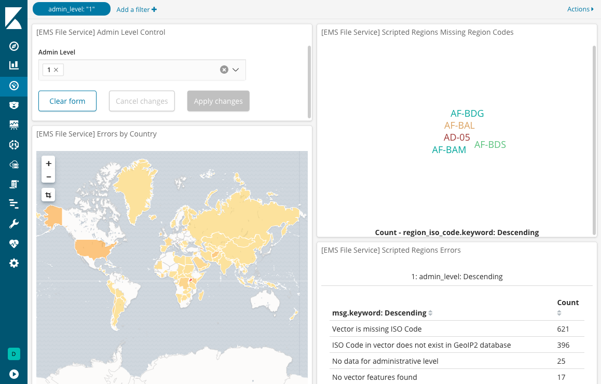

# Semi-automated EMS layer generation

*STATUS: Very experimental* 

This tool automatically attempts to generate country subdivision source data and GeoJSON vector files for administrative levels 1 and 2 (where applicable). 

## How it works

This tool requires the GeoLite2 City database in CSV format. 

1. Download and extract the CSV database from https://dev.maxmind.com/geoip/geoip2/geolite2/
1. Run the generate sources script with the location of the `GeoLite2-City-Locations-en.csv` as an argument.
   
    For example

    `node scripts/generate-sources/index.js ~/Downloads/GeoLite2-City-Locations-en.csv`

1. The script generates source metadata, GeoJSON files, and a log file in the `.scripted-regions` directory.
1. The `.scripted-regions/logs/regions.log` file contains warnings and errors about missing data. The logs can be ingested into Elasticsearch with [pino-elasticsearch](https://www.npmjs.com/package/pino-elasticsearch) to make Kibana dashboards like the screenshot above.
1. Resolve errors and copy the source metadata and GeoJSON files to their respective `source` and `data` directories.

## TODO
- [ ] Filebeat config with Kibana saved objects
- [ ] Clean up and refactor code for readability